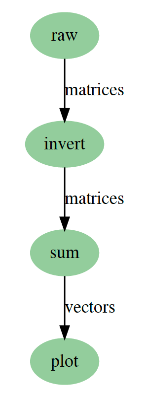

# Example Step Workflow

An example step workflow that does a whole bunch of simple random matrix inversion.

---

## Workflow
This example step workflow generates random matrices, inverts them, does a cumulative sum over an axis,
the finally plots them.

By default the workflow and all sub tasks are configured to run in a single process. However, there are example
steps called `mapped_raw` and `mapped_invert` to give an idea of how to switch from single threaded / process
to parallel data gathering and processing.

## Installation
`pip install git+https://github.com/AllenCellModeling/example_step_workflow.git`

## Development
See [CONTRIBUTING.md](CONTRIBUTING.md) for information related to developing the code.

### Developer installation
`pip install -e .[dev]`

***Free software: Allen Institute Software License***
